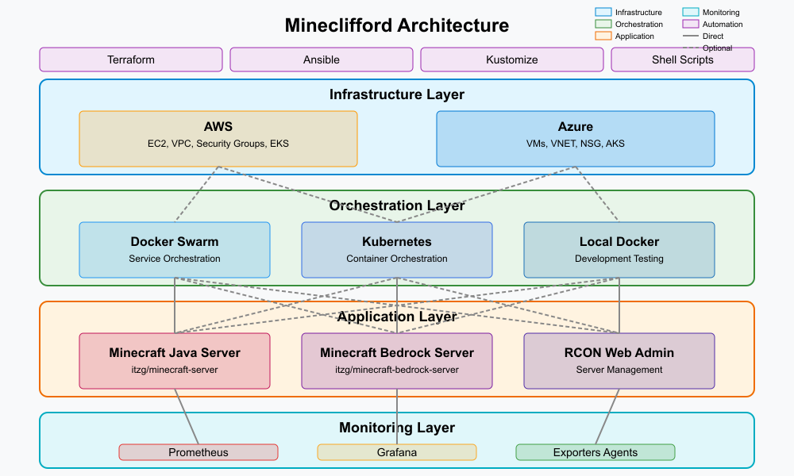

# Mineclifford


[](LICENSE)
[](https://www.terraform.io/)
[](https://kubernetes.io/)
[](https://www.docker.com/)

## Overview

Mineclifford is an automated provisioning and management tool for Minecraft servers on cloud infrastructure. It enables easy deployment, monitoring, and maintenance of Minecraft servers (both Java and Bedrock editions) on AWS and Azure, using either Docker Swarm or Kubernetes as the orchestration layer.

## Features

- **Multiple cloud providers**: AWS and Azure support
- **Multiple orchestration options**: Docker Swarm, Kubernetes, or local Docker
- **Support for both editions**: Java and Bedrock Minecraft
- **Flexible configuration**: Version, game mode, difficulty, and more
- **Infrastructure as code**: Terraform-based provisioning
- **Configuration automation**: Ansible for server configuration
- **Integrated monitoring**: Prometheus and Grafana dashboards
- **Scheduled backups**: Automated daily backups of world data
- **State management**: Consistent state handling across providers
- **Scalable architecture**: Support for multiple server instances

## Architecture



The diagram is organized into four primary layers:

1. **Infrastructure Layer** - Shows the cloud providers supported by the system:
   - AWS: Provisions EC2 instances, VPC, security groups, and EKS clusters
   - Azure: Deploys virtual machines, VNETs, NSGs, and AKS clusters

2. **Orchestration Layer** - Presents the container orchestration options:
   - Docker Swarm: For simpler deployments with service orchestration
   - Kubernetes: For more complex, scalable deployments
   - Local Docker: For development and testing

3. **Application Layer** - Displays the core application components:
   - Minecraft Java Server: Using the itzg/minecraft-server container
   - Minecraft Bedrock Server: Using the itzg/minecraft-bedrock-server container
   - RCON Web Admin: For server management

4. **Monitoring Layer** - Shows the monitoring stack:
   - Prometheus: For metrics collection and alerting
   - Grafana: For visualization and dashboards
   - Exporters & Agents: For collecting metrics from various sources

At the top, the diagram also shows the automation tools used throughout the system:

- Terraform: For infrastructure provisioning
- Ansible: For configuration management
- Kustomize: For Kubernetes configuration
- Shell Scripts: For automation and orchestration

The connecting lines indicate relationships between components, with solid lines showing direct dependencies and dashed lines showing optional paths.

This architecture provides a comprehensive visualization of your multi-cloud, multi-orchestration Minecraft server deployment system, showcasing its flexibility and modularity.

### Components

1. **Infrastructure Layer**:
   - AWS (EC2, VPC, Security Groups, etc.)
   - Azure (VM, VNET, NSG, etc.)

2. **Orchestration Layer**:
   - Docker Swarm for simpler deployments
   - Kubernetes for more complex, scalable deployments
   - Local Docker for development and testing

3. **Application Layer**:
   - Minecraft Java Server
   - Minecraft Bedrock Server
   - RCON Web Admin

4. **Monitoring Layer**:
   - Prometheus for metrics collection
   - Grafana for visualization
   - Node Exporter for host metrics
   - Minecraft Exporter for game metrics

## Prerequisites

To use Mineclifford, you need:

1. **Required CLI tools**:
   - Terraform v1.0.0+
   - Ansible v2.9+
   - Docker and Docker Compose
   - kubectl (for Kubernetes deployments)
   - AWS CLI (for AWS deployments)
   - Azure CLI (for Azure deployments)

2. **Cloud provider credentials**:
   - AWS: Configure using `aws configure` or environment variables
   - Azure: Configure using `az login`

3. **Environment setup**:
   - Clone this repository
   - Create a `.env` file with required variables (see `.env.example`)

## Quick Start

### Using the Unified Operations Script

The `minecraft-ops.sh` script provides a unified interface for all operations:

```bash
# Deploy with Docker Swarm on AWS
./minecraft-ops.sh deploy --provider aws --orchestration swarm

# Deploy with Kubernetes on Azure
./minecraft-ops.sh deploy --provider azure --orchestration kubernetes --k8s aks

# Deploy locally for testing
./minecraft-ops.sh deploy --orchestration local

# Check deployment status
./minecraft-ops.sh status --provider aws --orchestration swarm

# Destroy infrastructure
./minecraft-ops.sh destroy --provider aws --orchestration swarm
```

### Customizing Your Deployment

You can customize your Minecraft server by specifying options:

```bash
./minecraft-ops.sh deploy \
  --provider aws \
  --orchestration swarm \
  --minecraft-version 1.19 \
  --mode creative \
  --difficulty peaceful \
  --memory 4G
```

## Configuration

### Environment Variables

Create a `.env` file with the following variables:

```env
# AWS Configuration (for AWS provider)
AWS_ACCESS_KEY_ID=your_aws_access_key
AWS_SECRET_ACCESS_KEY=your_aws_secret_key
AWS_REGION=us-east-2

# Azure Configuration (for Azure provider)
AZURE_SUBSCRIPTION_ID=your_azure_subscription_id

# Minecraft Configuration
MINECRAFT_VERSION=latest
MINECRAFT_GAMEMODE=survival
MINECRAFT_DIFFICULTY=normal
MINECRAFT_MEMORY=2G
```

For more configuration options, see [Configuration Guide](docs/configuration.md).

### Terraform Variables

The infrastructure can be customized through Terraform variables:

- `project_name`: Name of the deployment (default: mineclifford)
- `region`: AWS region or Azure location
- `instance_type`: VM size/type
- `server_names`: List of server instance names

See [Terraform Variables Guide](docs/terraform-variables.md) for more details.

## Monitoring

Mineclifford includes a comprehensive monitoring solution:

- **Metrics Collection**:
  - Server resource usage (CPU, memory, network)
  - Minecraft-specific metrics (players, TPS, etc.)
  
- **Dashboards**:
  - Resource utilization
  - Player activity
  - Performance bottlenecks

- **Alerting**:
  - Server downtime
  - Resource constraints
  - Backup failures

Access Grafana dashboards at:

- Docker Swarm: [http://server-ip:3000](http://server-ip:3000)

- Kubernetes: <http://grafana.your-domain.com>

Default credentials: admin/admin (change on first login)

## Backups

Daily backups are configured automatically:

- **Docker Swarm**: Backups stored in `/home/ubuntu/minecraft-backups`
- **Kubernetes**: Volumes backed up using PVC snapshots

To manually trigger a backup:

```bash
# For Docker Swarm
ssh user@server-ip "/home/ubuntu/backup-minecraft.sh"

# For Kubernetes
kubectl exec -n mineclifford deploy/minecraft-java -- rcon-cli save-all
```

## Advanced Usage

### Multi-Server Deployment

To deploy multiple Minecraft servers:

```bash
./minecraft-ops.sh deploy \
  --provider aws \
  --orchestration swarm \
  --server-names "survival,creative,adventure"
```

### Custom Mods and Plugins

To add custom mods or plugins, see [Customization Guide](docs/customization.md).

### Custom Domain and SSL

To set up a custom domain with SSL:

```bash
./minecraft-ops.sh deploy \
  --provider aws \
  --orchestration swarm \
  --domain your-domain.com \
  --email your-email@example.com
```

## Troubleshooting

Common issues and solutions are documented in [Troubleshooting Guide](docs/troubleshooting.md).

## Contributing

Contributions are welcome! Please read our [Contributing Guidelines](CONTRIBUTING.md) before submitting a pull request.

## License

This project is licensed under the MIT License - see the [LICENSE](LICENSE) file for details.

## Acknowledgments

- [itzg/docker-minecraft-server](https://github.com/itzg/docker-minecraft-server) for the Docker images
- [Prometheus](https://prometheus.io/) and [Grafana](https://grafana.com/) for monitoring
- [Terraform](https://www.terraform.io/) and [Ansible](https://www.ansible.com/) for automation
